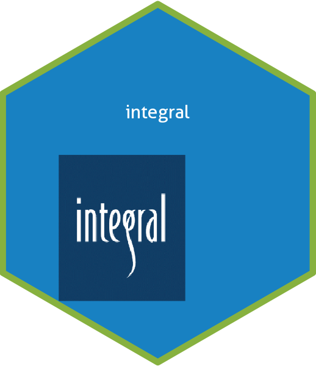

<!-- README.md is generated from README.Rmd. Please edit that file -->

```{r, include = FALSE}
knitr::opts_chunk$set(
  collapse = TRUE,
  comment = "#>",
  fig.path = "man/figures/README-",
  out.width = "100%"
)
```

# integral

# integral <a href='https://github.com/IntegralEnvision/integral'></a>

<!-- badges: start -->

[](https://lifecycle.r-lib.org/articles/stages.html#experimental)

<!-- badges: end -->

This is a beta package for **PRIVATE** Integral functions.

## Installation

You can install the development version of integral from [GitHub](https://github.com/) with:

``` r
# install.packages("devtools")
devtools::install_github("IntegralEnvision/integral-private")
```
