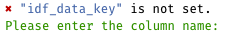

There are several functions in integral that are designated as "interactive helpers", meaning that they are intended for use in an interactive session where you are using them in the console rather than in the script itself.

The first one I'll introduce this week is idf(), short for "interactive data filter".

Often in data workflows you have two or more tables / data frames that you are working with that have different data about a certain sample (i.e. they have a key column, for example with soil or water samples such as sample_id. Most commonly these are data that are going to be merged/joined.

During development of a script, sometimes you will encounter an error or issue that occurs with a specific sample id. In order to examine the data and help identify the issue, you want to look at the rows for that specific sample in each data set, so you would do something like data_main %\>% filter(sample_id == "317a" and then `data_secondary %>% filter(sample_id == "317a")` and examine the values. After identifying what you think is the issue, you might change something in the code and try again, and if it doesn't work you might want to re-examine the modified data for that particular sample. At this point you would be typing the same code in the console to view it.

idf() simplifies this process:

1.  Reduces typing: `idf("317a")` is equivalent to: `filter([key_col] == "317a")`. Upon first use, it creates a hidden environmental variable for the key column so that it doesn't need to be typed each time once it is set.

2.  Stores the last-used sample id so it doesn't need to be typed each time: `data %>% idf()` is equivalent to the longer code examples above.

The first time you use it you will be prompted to set the key column:



Example

```{r}
library(tidyverse)
library(integral)

#Set up example data
set.seed(1234)
dat <- starwars %>% 
  mutate(character_id = sample(1:1000, 87), .before = name)

## Split into two datasets for our example, retaining the `character_id` key column:
demographics <- dat %>% 
  select(character_id:gender, homeworld, species)

metadata <- dat %>% 
  select(character_id, films:last_col()) %>% 
  unnest(films, keep_empty = T) %>% 
  unnest(vehicles,  keep_empty = T) %>% 
  unnest(starships,  keep_empty = T)

# Examine a particular sample identified by `character_id`

## Classic method:
demographics %>% filter(character_id == 284)
metadata %>% filter(character_id == 284)

## Simplified idf() method:

options(idf_data_key = "character_id")

demographics %>% 
  idf(284)


metadata %>% idf()

demographics %>% 
  mutate(height_feet = height / 12) %>% 
  idf()

```

Advanced usage:

-   You can manually set the key column in a script during development with options `options(idf_data_key = [key_column])`. You can also change the stored key_column using this code.
-   adding an argument `glimpse = T` will display the results using `dplyr::glimpse()`: `idf(glimpse = T)`
